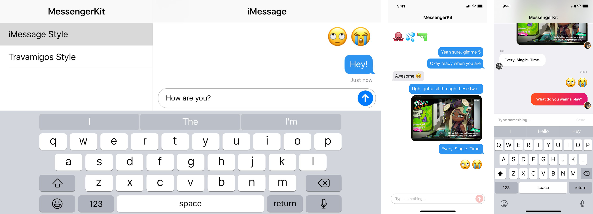

<p align="center">
    
</p>

<p align="center">
    <a href="https://opensource.org/licenses/MIT">
        
    </a>
</p>

---

## About

This an updated version of [MessengerKit](https://github.com/steve228uk/MessengerKit), a drop-in UI for messenger interfaces on iOS built in Swift. Centred around a single `UIViewController`, VHMessengerKit is themeable to fit your needs and includes a number of powerful features:

- [x] `UICollectionView` based with pre-loading and caching of size calculation for bubbles.
- [x] Auto-growing input view.
- [x] Multiple cell types: text, large-emoji, image, video, location and gifs.
- [x] Presentation of `SFSafariViewController`.
- [x] Built-in, customisable themes.
- [x] A custom theming system to bring your own `UICollectionViewCell`s, headers, footers, and input views.
- [x] Avatar support (currently only in the `travamigos` theme).

The framework is actively being used and maintained in one of our apps, [Vivus](http://vivushub.com/?adFor=social&ref=github).

## Screenshots

<p align="center">
    
</p>

## Documentation

- [Getting Started](https://github.com/steve228uk/MessengerKit/wiki/Getting-Started)
- [Customising an Existing Style](https://github.com/steve228uk/MessengerKit/wiki/Customising-an-Existing-Style)
- [Creating a Custom Style](https://github.com/steve228uk/MessengerKit/wiki/Creating-a-Custom-Style)

## Installation

MessengerKit requires Swift 4.2 and iOS 11.0 or later.

### Manual

Drag the contents of the `VHMessengerKit` folder into your Xcode Project.

### CocoaPods

Add the following to your project's Podfile.

```ruby
pod 'VHMessengerKit' , :git => 'https://github.com/VivusHub/VHMessengerKit'
```

## Credits

* Updated by [@VivusHub](https://twitter.com/vivushub).
* It makes use of [KeyboardUtility](https://github.com/JunyuKuang/KeyboardUtility) by [@JunyuKuang](https://github.com/JunyuKuang).
* Thanks to [@steve228uk MessengerKit](https://github.com/steve228uk/MessengerKit) for which this project is based upon.

## License
Extract from [Vivus Hub commercially available contents agreement](https://www.vivushub.com/vivus/interface/terms):


When using our free contents you have the permission to use, reproduce, publicly perform, publicly display, modify, translate, distribute, publish in whole or in part as long as:

- [x] Vivus hub is referenced in such work through e.g a copy of this Vivus Hub 'Commercially Available Contents' terms or url link back to our terms and conditions.
- [x] In the event you collect information about users, you must make it clear you (not Vivus hub) are the ones collecting such information.

The software is provided 'As is', without warranty of any kind, express or implied, including but not limited to the warranties of merchantability, fitness for a particular purpose and non-infringement. In no event shall the authors or copyright holders be liable for any claim, damages or other liability, whether in an action of contract, tort or otherwise, arising from, out of or in connection with the software or the use or other dealings in the software.
